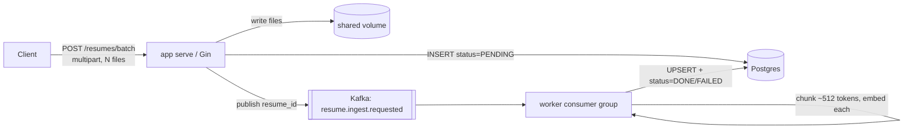
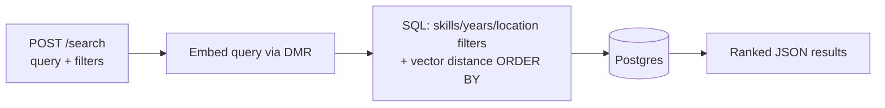

# atlas

High-performance PDF ingestion and indexing service for AI-powered knowledge retrieval and vector search.

Bulk-upload PDF resumes, process them asynchronously (Kafka → text extraction → LLM field extraction → chunked embeddings), and search them with a hybrid semantic + filtered query — all via `docker compose up`.

## Architecture

Hexagonal (ports & adapters): `domain` (framework-free entities) → `service` (use cases + port interfaces) → `adapter/driver` (HTTP via Gin, Kafka consumer — drive the app) / `adapter/driven` (Postgres, Kafka producer, Docker Model Runner client, PDF extraction — driven by the app). See [decisions.md](decisions.md) for the reasoning behind every non-obvious choice.

### Ingestion flow



### Query flow



## Running it

```bash
docker compose up --build
```

First run pulls the LLM/embedding models via Docker Model Runner (`ai/qwen3` and `ai/nomic-embed-text-v1.5`) — expect that step to take a few minutes. If the `ai/qwen3` pull ever fails partway through with a registry error, swap it for a smaller model you already have (e.g. `ai/llama3.2`) in a local `docker-compose.override.yml` — see [decisions.md](decisions.md) for why this exists.

## Try it with the sample resumes

```bash
curl -F "files=@data/resumes/01_alice.pdf" -F "files=@data/resumes/02_bruno.pdf" http://localhost:8080/resumes/batch
# -> {"batch_id": "...", "resumes": [{"id": "...", "filename": "01_alice.pdf"}, ...]}

curl http://localhost:8080/resumes/batch/<batch_id>
# poll until every resume shows "status": "DONE"

curl -X POST http://localhost:8080/search \
  -H "Content-Type: application/json" \
  -d '{"query": "backend engineer with distributed systems experience", "required_skills": ["go", "kafka"], "min_years": 3}'
```

`data/resumes/` ships 12 short, clearly-fake sample resumes with varied skills, years of experience, and locations so the search filters have something real to differentiate.

## Scaling workers

```bash
docker compose up --scale worker=3
```

## Testing

```bash
make test-unit          # no Docker required
make test-integration   # requires Docker (testcontainers-go)
```
