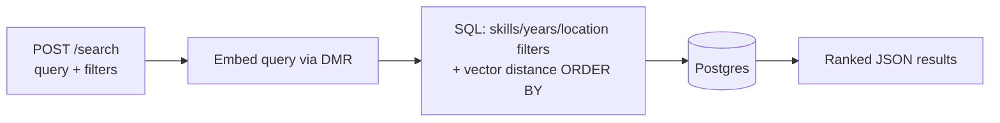

# atlas

High-performance PDF ingestion and indexing service for AI-powered knowledge retrieval and vector search.

Bulk-upload PDF resumes, process them asynchronously through a 3-stage Kafka pipeline (text extraction → LLM field extraction → chunked embeddings), and search them with a hybrid semantic + filtered query — all via `docker compose up`.

## Architecture

Hexagonal (ports & adapters): `domain` (framework-free entities) → `service` (use cases + port interfaces) → `adapter/driver` (HTTP via Gin, Kafka consumer — drive the app) / `adapter/driven` (Postgres, Kafka producer, model client, PDF extraction — driven by the app). The model client speaks OpenAI-compatible chat/completions and embeddings against two independent backends: chat/extraction against a hosted API (e.g. Groq), embeddings against Docker Model Runner. See [decisions.md](decisions.md) for the reasoning behind every non-obvious choice.

### Ingestion flow

Each resume moves through 3 independent Kafka topics/consumer groups — extract, classify, embed — so a slow LLM call can't block extraction or embedding for other resumes on the same stage. A `stage` column tracks which one a resume is currently on; `GET /resumes/:id` exposes it directly, and `GET /resumes/:id/file` serves the original uploaded file back, rendered inline in the browser. A periodic redrive sweeper reclaims any resume that hasn't advanced in a while (crashed mid-stage, before its next publish) and republishes it to the right topic, up to a bounded number of retries before giving up and marking it `FAILED`.


### Query flow



## Running it

Requires a hosted OpenAI-compatible chat API key (e.g. from [Groq](https://console.groq.com)) — set `LLM_URL`, `LLM_MODEL`, `LLM_API_KEY` in `.env` (see `.env.example`) before starting; `serve`/`worker` exit immediately without them.

```bash
docker compose up --build
```

First run pulls the embedding model via Docker Model Runner (`ai/nomic-embed-text-v1.5`) — expect that step to take a few minutes, and expect the very first embed request afterward to pay a one-time cold-start cost while the model loads into the runner (see `EmbedAttemptTimeout` in `internal/constants/constants.go`). Chat/extraction has no such cold-start — it runs against the hosted API.

## Try it with the sample resumes

```bash
curl -F "files=@data/resumes/01_alice.pdf" -F "files=@data/resumes/02_bruno.pdf" http://localhost:8080/resumes/batch
# -> {"batch_id": "...", "resumes": [{"id": "...", "filename": "01_alice.pdf"}, ...]}

curl http://localhost:8080/resumes/batch/<batch_id>
# poll until every resume shows "status": "DONE"
# ("stage" shows which of EXTRACT/CLASSIFY/EMBED a still-PROCESSING resume is on)

curl -X POST http://localhost:8080/search \
  -H "Content-Type: application/json" \
  -d '{"query": "backend engineer with distributed systems experience", "required_skills": ["go", "kafka"], "min_years": 3}'

curl -OJ http://localhost:8080/resumes/<resume_id>/file
# downloads the original PDF; opening the same URL in a browser renders it inline
```

`data/resumes/` ships 12 short, clearly-fake sample resumes with varied skills, years of experience, and locations so the search filters have something real to differentiate.

Only `.pdf` uploads are accepted — a non-PDF file anywhere in a batch rejects the whole batch before anything is written to disk or Postgres.

## Web UI

After `docker compose up --build`, open `http://localhost:8080/ui/upload` in a browser.

A minimal server-rendered UI lives alongside the JSON API on the same port: `/ui/upload` (multipart upload form), `/ui/batch/<id>` (status table with a manual Refresh button — no auto-polling), `/ui/processing` (every batch's aggregate status counts, newest first, plus a jump-to-batch-ID form), and `/ui/search` (the same search filters as `POST /search`, rendered as a table, with a "View" link per result that opens the actual PDF in a new tab). It's a thin HTML-rendering layer in front of the same use cases the JSON API calls — no separate business logic; `/ui/processing` has no JSON API counterpart, since nothing outside the browser UI needs the batch list.

A use-case failure never shows its raw internal error in the browser: the page renders a generic message plus a short slug (e.g. `internal-error`), while the real error goes to the server logs. The JSON API is unchanged and still returns the raw error in its response — see `decisions.md` for why.

## Scaling workers

```bash
docker compose up --scale worker=3
```

## Testing

```bash
make test-unit          # no Docker required
make test-integration   # requires Docker (testcontainers-go)
```
